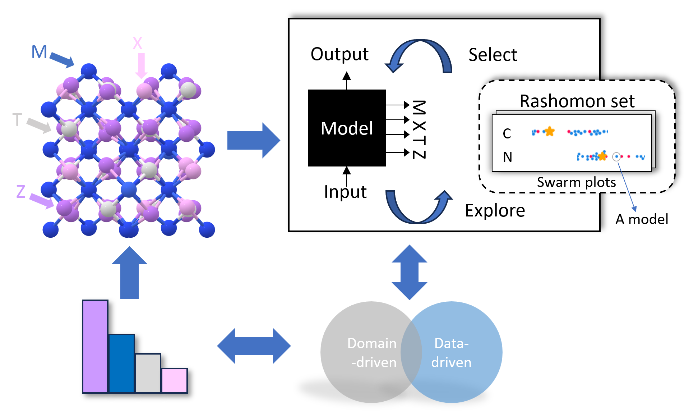

# Multi-Target Neural Network Predictions of MXenes as High-Capacity Energy Storage Materials in a Rashomon set


This repository includes the implementation of the paper (https://papers.ssrn.com/sol3/papers.cfm?abstract_id=4520129). The paper emphasizes the importance of investigating feature interactions not just in a single predictive model, but across a range of well-performing models, illustrated below.



## Summary

This paper aim to analyze MXenes through a set of equally good machine learning models and offer a universal feature importance analysis within a Rashomon set.
The highlights of this paper are:

1. Neural networks are used for advanced multi-target regression with superior performance and flexibility.

2. A Rashomon set of accurate models offers more comprehensive universal feature importance.

3. Domain knowledge is integrated to provide target-specific model selection process.
----

## Project structure
The project is constructed following the below structure:
```
project
│   README.md
│   requirement.txt    
│   ...
└───data
│   │   data_file.csv
└───src
│   │   find_RF_parames.py
│   │   standard_vis.py
│   │   train_nn...py
│   │   ...
└───experiments
│   │   MXen-categorical-descriptor-Rset.ipynb
│   │   MXen-elemental-descriptor-Rset.ipynb
│   │   ...
└───logs
│   │   ...
└───results
│   │   figs
│   │   models
│   │   ...
───────────
```

## Requirements
FISC is a designed based on Python language and specific libraries. Four most commonly-used are listed as follows:

* Python
* Jupyter Notebook
* Numpy
* Matplotlib

FISC is a model-agnostic framework and experiments might have different requirements, depending on the data and model
types. To implement the experiments in the paper, dependencies in [requirements.txt](.\requirements.txt) are required.

```python
python -r .\requirements
```
### Installment

```
pip install -i https://test.pypi.org/simple/ generalized-rashomon-set
```
### Usage
```
import grs

# train a MLP model
model =  MLPRegressor(hidden_layer_sizes, max_iter=200).fit(X, y)

# explain the model by exploring the Rashomon set
explainer = grs.explainers.fis_explainer()

# visualize the predictions
grs.plots.swarm_plot()
grs.plots.halo_plot()
```
----

----

## Experiments

Code is provided to reproduce the experiments of our paper in [experiments](experiments).
